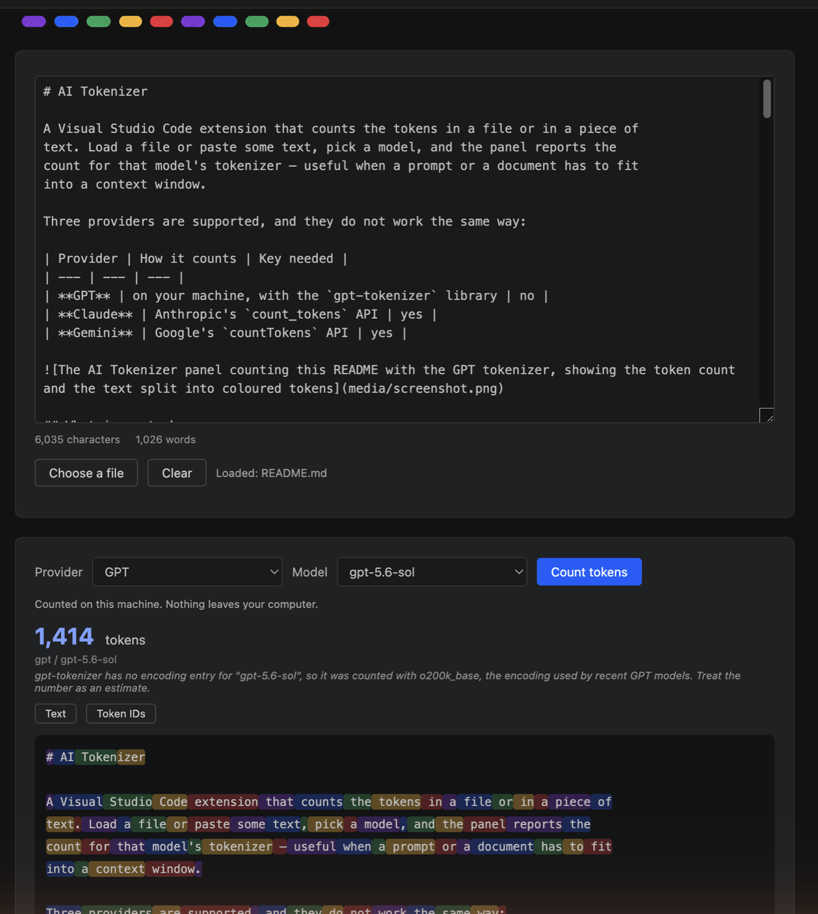

# AI Tokenizer

A Visual Studio Code extension that counts the tokens in a file or in a piece of
text. Load a file or paste some text, pick a model, and the panel reports the
count for that model's tokenizer — useful when a prompt or a document has to fit
into a context window.

Three providers are supported, and they do not work the same way:

| Provider | How it counts | Key needed |
| --- | --- | --- |
| **GPT** | on your machine, with the `gpt-tokenizer` library | no |
| **Claude** | Anthropic's `count_tokens` API | yes |
| **Gemini** | Google's `countTokens` API | yes |

## What is sent where

**GPT counting is entirely local.** The text never leaves your computer, and the
extension works offline.

**Counting with Claude or Gemini sends the loaded text to the provider.** There
is no local tokenizer for those models, so counting means calling their API: the
whole text goes to Anthropic or to Google over HTTPS, along with your key. The
extension asks for confirmation the first time you count with each of them, and
remembers the answer.

Nothing else is sent anywhere: no telemetry, no analytics, no update check. The
text you load is never written to disk — it lives in the open panel and
disappears with it, and the **Clear** button empties it immediately. See
[SECURITY.md](SECURITY.md) for the full scope.

## API keys

Run **AI Tokenizer: Set API Key** — or press **Paste a key** in the panel — and
paste the key into the masked prompt. It goes straight into the editor's
encrypted secret storage: never into `settings.json`, never carried between
machines by Settings Sync, and never shown on screen. The extension contributes
no settings at all, precisely so that a key cannot end up in a settings file.

The panel shows whether a key is stored for the selected provider, and
**AI Tokenizer: Clear Stored API Keys** removes both. Secret storage is shared
between editor profiles, so a key set once works everywhere — and clearing it
clears it everywhere.

- **Claude**: an Anthropic API key (`sk-ant-…`) from
  [console.anthropic.com](https://console.anthropic.com/settings/keys). The API
  account is separate from a Claude.ai subscription. Counting tokens does not
  consume model tokens, but it is an API call and is subject to rate limits.
- **Gemini**: a free key from
  [aistudio.google.com](https://aistudio.google.com/apikey).
- **GPT**: no key at all.

## Usage

1. Open the Command Palette (`Ctrl/Cmd+Shift+P`) and run
   **AI Tokenizer: Open Token Counter**. The panel opens beside whatever you are
   editing. You can also right-click a `.md` file in the Explorer to open it
   straight in the panel.
2. Provide the content: paste or type it into the text box, drag a file anywhere
   into the window, or press **Choose a file** for a file dialog.
3. Choose a provider and a model, then press **Count tokens**.

**While the panel is open it follows the editor**: whatever file you switch to
is loaded into it, replacing what was there. That is what makes dragging work.
VS Code claims a dropped file before any panel can see it and opens it as an
editor tab; the panel then takes that file over — it loads the content and
closes the tab again, so the file ends up counted rather than opened. A file
opened for reading, one with unsaved changes, and one that has been open for
more than a moment are loaded but never closed.

Text you typed or pasted is replaced the same way, so paste into the panel when
no file is going to be opened next, or count it before switching files.

The panel also shows a character and word count, computed locally as you type.

For GPT models the result includes the token breakdown: the text split into the
pieces the tokenizer produced, coloured in sequence, with a switch to the raw
token IDs. Claude and Gemini return a number only — their APIs do not expose the
individual tokens — so there is nothing to colour there.

If the model you need is not in the list, choose **Other model ID...** and type
the identifier. Model lists change faster than releases do.

## What the numbers mean

A token count is only as good as the tokenizer behind it.

Claude and Gemini counts come from the provider's own endpoint, so they match how
that provider will count the same text. Both APIs count a complete request, so
the number includes the small overhead of the message structure around your
text, not the characters alone.

GPT counts are computed locally from the encoding table that `gpt-tokenizer`
maps the model to. When a model is not in that table — which is the case for
models released more recently than the library — the text is counted with
`o200k_base`, the encoding used by recent GPT models, and the result is marked
as an estimate in the panel. Treat those numbers as close, not exact.

## What it does not do

It does not send anything to a model, does not estimate cost, does not count
images or other non-text content, and does not verify that a model identifier is
real before asking the provider about it. Files above 10 MB are refused, because
counting them would freeze the panel.

## Installation

Install "AI Tokenizer" from the Visual Studio Code Marketplace, or download a
`.vsix` from the repository's Releases page and install it with
`Extensions: Install from VSIX...`.

## Feedback and security

- Bugs and feature requests:
  [GitHub Issues](https://github.com/Beata-Humeniuk/ai-tokenizer/issues)
- Security issues: see [SECURITY.md](SECURITY.md) — please never include a real
  API key or confidential text in a report.

## License

[MIT](LICENSE) — see also the [changelog](CHANGELOG.md).
